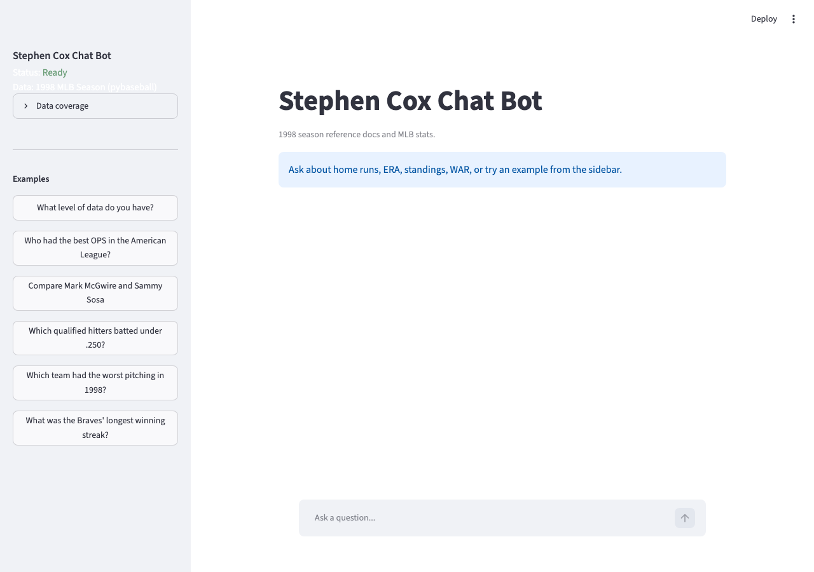
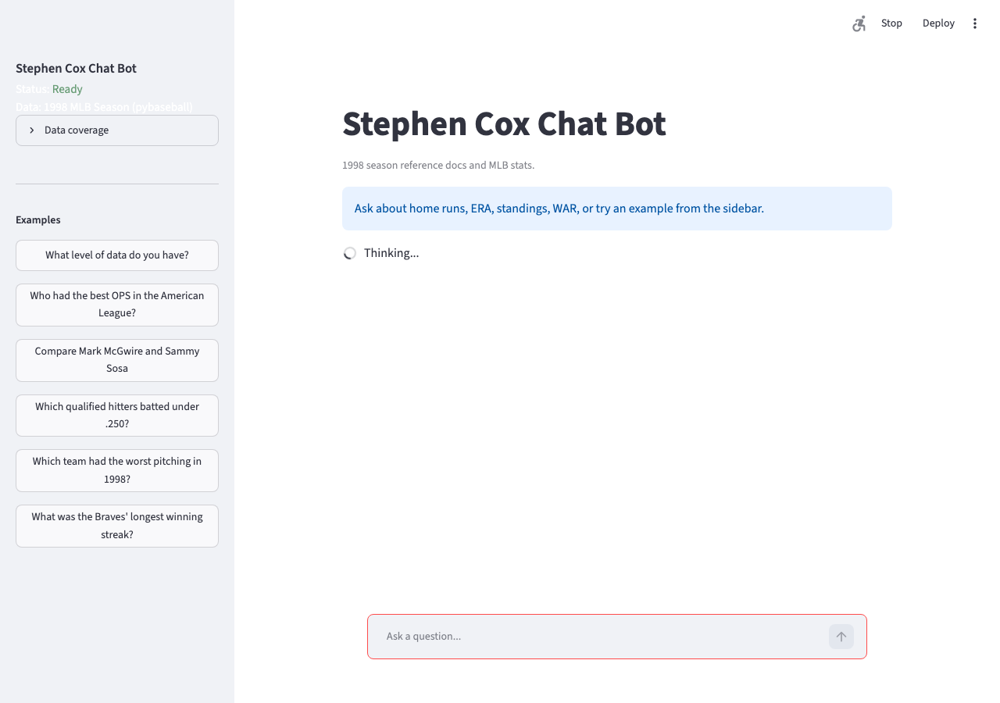
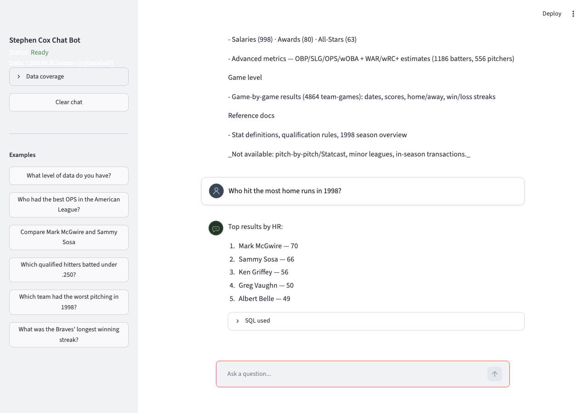
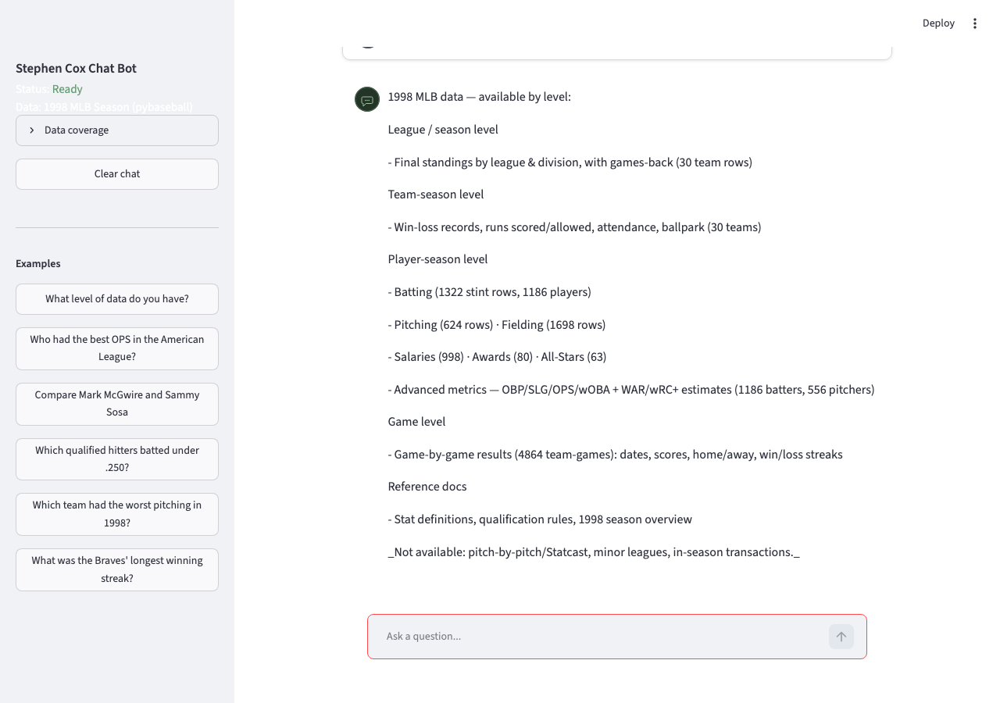
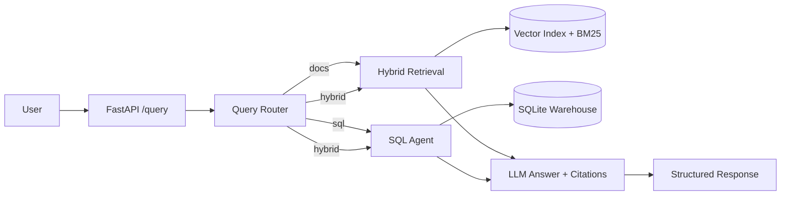

# InsightRAG

[](https://github.com/stephencox1026/insightrag/actions/workflows/ci.yml)

A production-style **agentic RAG assistant** for the **1998 MLB season** — answer
questions across **reference documents** (stat definitions, rules, season overview)
and **live operational data** (a 1998 stats warehouse built via `pybaseball`).
Document questions return grounded answers with citations; data questions run
read-only SQL against player and team tables. A query router picks docs / SQL / hybrid;
meta questions return a structured data catalog.

Built to be runnable in one command. **Open-ended MLB stats questions require
online text-to-SQL** (set `OPENAI_API_KEY` or Ollama). Offline mode still works for
document-only questions.

> Portfolio Project 1 (GenAI / RAG / agents). Companions: [DocPulse](https://github.com/stephencox1026/docpulse), [TourMind](https://github.com/stephencox1026/tourmind).

---

## Live demo

- **App:** _Deploy via [docs/SHIP.md](docs/SHIP.md) — paste Streamlit Cloud URL here_  
  - Repo: [`stephencox1026/insightrag`](https://github.com/stephencox1026/insightrag)  
  - Main file: `ui/cloud_app.py`
- **Demo video (Loom):** _Add link after recording_ — script in [docs/DEMO.md](docs/DEMO.md)

### Screenshots

| Chat | Sources |
|------|---------|
|  |  |

| SQL | Catalog |
|-----|---------|
|  |  |

---

## What it demonstrates

| Skill | Where |
|-------|-------|
| Retrieval-Augmented Generation (RAG) | `app/retrieval.py`, `app/pipeline.py` |
| Hybrid search (dense vectors + BM25, score fusion) | `app/vector_store.py` |
| Postgres + pgvector OR SQLite fallback | `app/db.py`, `docker-compose.yml` |
| Query routing / tool selection | `app/router.py` |
| Text-to-SQL agent with read-only guardrail | `app/sql_agent.py`, `app/warehouse.py` |
| Grounded answers with citations | `app/pipeline.py` |
| Provider abstraction + offline fallback | `app/embeddings.py`, `app/llm.py` |
| FastAPI microservice + health/readiness probes | `app/api.py` |
| Streamlit chat UI | `ui/streamlit_app.py` |
| Deterministic evaluation harness + metrics | `scripts/evaluate.py`, `data/golden_qa.json` |
| Meta / capabilities catalog | `app/capabilities.py` |
| MLB warehouse loader (pybaseball) | `app/mlb_loader.py`, `app/warehouse.py` |

---

## Quickstart (5 minutes, no API key needed)

```bash
git clone https://github.com/stephencox1026/insightrag.git
cd insightrag
python3 -m venv .venv
make install          # installs into .venv
make demo             # seeds the SQLite warehouse + builds the doc index
make ui               # open the Streamlit chat UI
```

### Streamlit Cloud

1. Connect repo `stephencox1026/insightrag`
2. Main file: **`ui/cloud_app.py`**
3. Uses `requirements.txt` — first boot seeds the offline demo automatically
4. No secrets required for document / catalog questions (see [docs/SHIP.md](docs/SHIP.md))

Or run the API:

```bash
make api              # http://localhost:8000/docs
curl -X POST localhost:8000/query -H 'content-type: application/json' \
  -d '{"question":"Who hit the most home runs in 1998?"}'
```

### Free / local mode with Ollama (no API key, recommended)

Run generative text-to-SQL locally for free with [Ollama](https://ollama.com):

```bash
brew install ollama && brew services start ollama
ollama pull qwen2.5:7b
```

Then in `.env`:

```
INSIGHTRAG_LLM_PROVIDER=ollama
INSIGHTRAG_CHAT_MODEL=qwen2.5:7b
INSIGHTRAG_OLLAMA_BASE_URL=http://127.0.0.1:11434
INSIGHTRAG_OFFLINE=false
```

Common questions are answered instantly by deterministic SQL templates; anything
else goes through a **self-correcting** text-to-SQL loop (generate → execute →
feed errors back → retry) grounded in a rich schema context. To use OpenAI
instead, set `OPENAI_API_KEY` and `INSIGHTRAG_LLM_PROVIDER=openai`.

#### Game-level data (optional)

Season/player/team stats load offline from Lahman. Game-by-game logs (for streak
and date questions) are scraped once from Baseball-Reference and cached:

```bash
python -c "from app.mlb_loader import prefetch_game_logs; print(prefetch_game_logs())"
make demo   # re-seed to load the cached game logs
```

### With Docker + Postgres (recommended for production story)

Requires [Docker Desktop](https://www.docker.com/products/docker-desktop/).

```bash
cp .env.example .env          # set OPENAI_API_KEY for online mode
make docker-up                # Postgres + pgvector on :5432
make demo-docker              # seed warehouse + pgvector index
make eval
```

See [docs/DOCKER.md](docs/DOCKER.md) for details.

### Online mode smoke test

```bash
# After setting OPENAI_API_KEY in .env
make test-online              # smoke + full eval → docs/METRICS_ONLINE.md
```

---

## Architecture



- **Retrieval**: query is embedded, scored against a persisted vector index by
  cosine similarity, fused with BM25 keyword scores (min-max normalized,
  weighted by `HYBRID_ALPHA`), and the top-k chunks are returned.
- **SQL agent**: translates a natural-language question to a single read-only
  SQL statement — deterministic templates first, then a self-correcting
  LLM loop (generate → validate → execute → repair on error) using a rich,
  live schema context with sample values, join paths, and name-matching rules.
- **Offline mode**: when no API key is present, embeddings use deterministic
  feature-hashing and answers are extractive — so the whole system runs and is
  fully testable with zero external calls.

---

## Evaluation

Run the golden-set evaluation:

```bash
make eval             # writes docs/METRICS.md
```

For SQL questions, run eval in **online mode** (set `OPENAI_API_KEY`).

| Metric | Value |
|--------|-------|
| Route accuracy | 100% |
| Source recall@k (doc questions) | 100% |
| Keyword in answer | 89% |
| SQL validity | 100% |
| SQL keyword match | 83% |
| Latency p50 / p95 | ~0.4 ms / ~0.9 ms |

\* **Keyword in grounded** checks answer + citation snippets (retrieval quality).
**Keyword in answer** checks final text only — lower in offline extractive mode;
run `make test-online` with an API key for synthesized answers.

---

## Project layout

```
app/          core library (config, embeddings, llm, retrieval, sql_agent, pipeline, api)
ui/           Streamlit chat UI
scripts/      build_demo.py (bootstrap), evaluate.py (metrics)
data/         sample docs, golden_qa.json, generated index + warehouse
tests/        pytest suite (chunking, warehouse, pipeline, api)
docs/         ADRs, METRICS.md, DEMO.md
```

---

## Roadmap (production / enterprise tiers)

- Multi-agent orchestration (LangGraph planner + critic + reconciliation)
- pgvector / Postgres warehouse (swap behind existing interfaces)
- Cross-encoder reranker, semantic cache, LoRA-fine-tuned models
- Guardrails, human-feedback loop, observability dashboards, cloud deploy

See the portfolio plan for the full milestone map.
